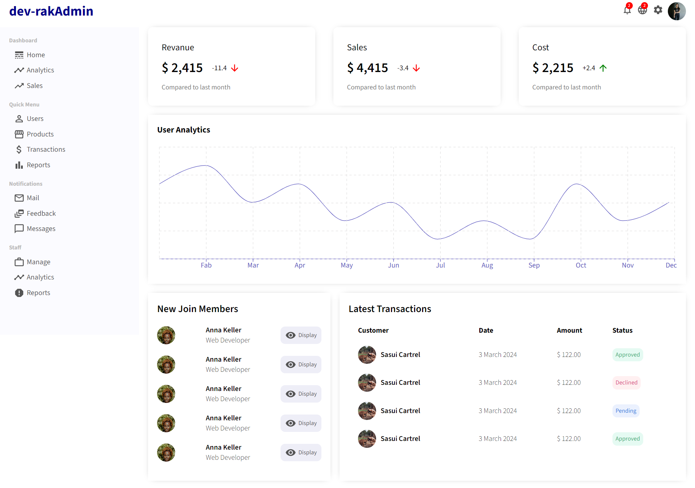

# :closed_book: Admin Dashboard

### _admin dashboard using react !!_

### Link :link: https://rak-admin-dashboard.netlify.app/

## Interface

## Run Locally

  - Run This command `https://github.com/developer-rak/admin_dashboard_react.git`
  - You are now in the dev environment and you can play around

## ✨ Features
  - Home (Revenue, sales, cost, Analytics, new member join and last transactions)
  - User (id, username, email, transaction volume (create user, edit user))
  - Product (id, username, email, price, status (edit and delete))

## ⚙️ Tech Stack
  - HTML5
  - CSS
  - Mui Material UI
  - Mui Icons
  - Mui DataGrid
  - React
  - recharts
  - Netlify
